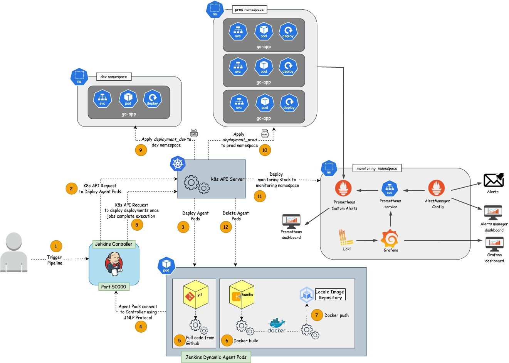

# ST2DCE - DevOps and Continuous Deployment Project

## Description

The main goal of this project is to build an application and deploy it on a Docker/Kubernetes infrastructure.

## Team Members

- Pierre Bonnet
- Arthur Buisson
- Timothée Fougeron

## Architecture Diagram



## How to run the project locally

### Prerequisites

- Docker
- Kubernetes (Minikube or similar)

### Installation Steps

#### 1. Run minikube cluster

```bash
minikube start cpus=6 memory=5120 disk-size=40g driver=docker addons=registry
```

#### 2. Clone the repository:

```bash
git clone https://github.com/pierrebonnet78/ST2DCE-Devops-Project.git
cd ST2DCE-Devops-Project
```

#### 3. Build Jenkins image

```bash
docker build -t jenkins_controller ./jenkins/
```

#### 4. Run Jenkins container

```bash
docker run -d --name jenkins --privileged -p 8080:8080 -p 50000:50000 -v jenkins_home:/var/jenkins_home --network minikube jenkins_controller
```

#### 5. Get initial Jenkins password

```bash
docker exec jenkins cat /var/jenkins_home/secrets/initialAdminPassword
```

#### 6. Open jenkins in your browser at localhost://8080

Use the following credentials :

- username : admin
- password : _the password you get at stage 4_

#### 7. Generate the kubeconfig file for jenkins to connect to the cluster

```bash
chmod +x ./jenkins/update_kubeconfig.sh
```

```bash
./jenkins/update_kubeconfig.sh
```

#### 9.Set the Jenkins URL

From the jenkins web UI, go to Manage Jenkins > System >

Modify the Jenkins URL by the output of the following command :

```bash
ipconfig getifaddr en0
```

#### 8. Create a jenkins secret file credentials with the file generated at step 7

From the jenkins web UI, go to Manage Jenkins > Credentials > System > Add credentials :

- Type : Secret file
- Scope : Global
- File : Upload the file generated at step 7 (_config_jenkins_ inside the directory : _$HOME/.kube_)
- ID : kubeconfig

#### 9. Create a new kubernetes cloud

From the jenkins web UI, go to Manage Jenkins > Clouds > New cloud :

- Cloud name : kubernetes
- Type : Kubernetes

Add the cloud then select the credentials _kubeconfig_ created at step 8.

Test the connection, you should obtain :


### Run the pipeline

The pipeline is automatically created when the jenkins container is run. As well as all required plugins.

To run the pipeline, go to the jenkins dashboard and run the _Deploy-Go-App_

The pipeline should start and the final log looks like this :


Follow the instructions given at the end of the pipeline to test :

- the application in prod and dev environnement
- the custom alerts
- the email notifications triggered by the alerts
- the grafana dashboard with errors logs in production
